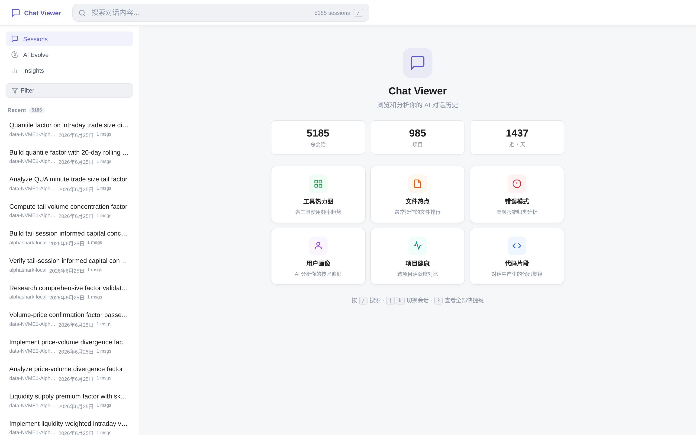
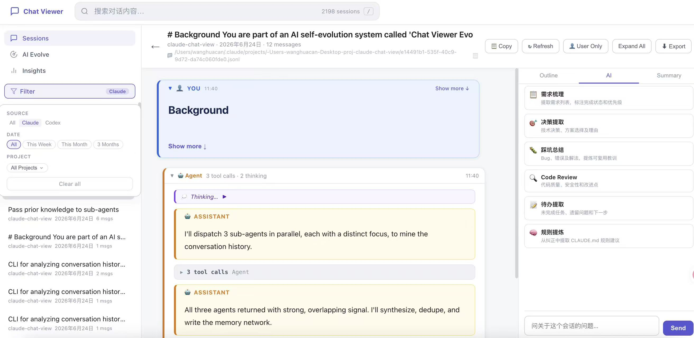
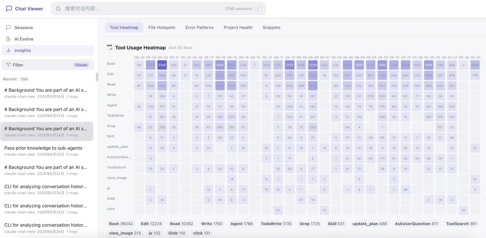
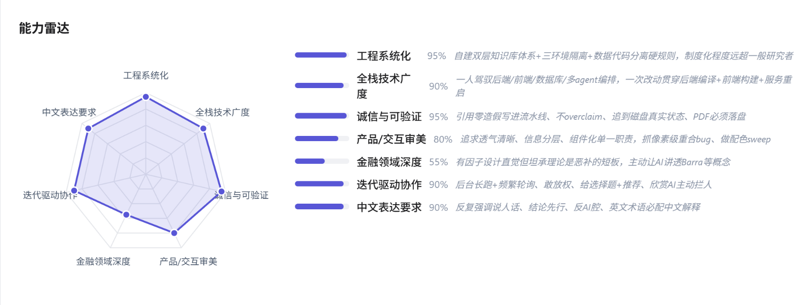
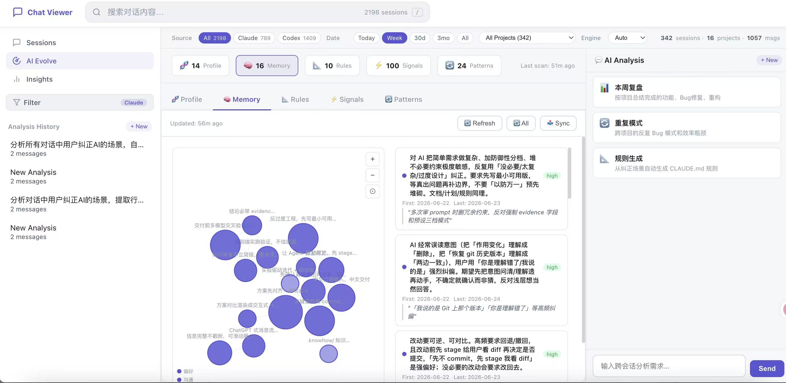
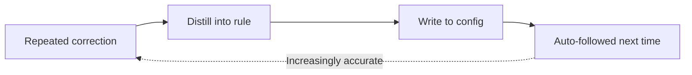

<div align="center">

# ConvoLab

**Turn your AI conversations into reusable assets, not disposable chats.**

ConvoLab is a locally-run AI conversation analysis tool. It reads all your conversations with programming assistants like Claude Code and Codex, indexes them into a searchable and analyzable knowledge base, then distills your development habits, preferences, and recurring corrections — writing these conclusions back into AI configuration files so future sessions adapt to your style.

Built for developers who use AI coding assistants daily and want to actually leverage those conversations.

[](https://python.org) [](.) [](.) [](https://sqlite.org) [](https://d3js.org)

**[中文](README.md)** | **English**

</div>

---

## Quick Start

ConvoLab has zero dependencies: no pip, npm, or Docker needed — just Python 3.8+.

```bash
git clone https://github.com/QuantaAlpha/ConvoLab.git
cd ConvoLab
python3 server.py
```

Open `http://localhost:5757` after startup. It automatically scans Claude Code and Codex session directories — no manual import required. Both sources are merged into a single list with source labels.

Browsing, searching, and insights work out of the box without any AI engine. AI Chat, the Evolve engine, and the Cognitive Handbook require a local Claude Code or Codex CLI installation. ConvoLab calls the local CLI directly — no API key needed.

```bash
npm i -g @openai/codex
# or
npm i -g @anthropic-ai/claude-code
```

Prerequisites:

- Python 3.8+
- Claude Code session data: `~/.claude/projects/`
- Codex session data: `~/.codex/sessions/`

---

## The Problem It Solves

Every AI conversation contains valuable artifacts: why an architecture decision was made, the debugging trace of a tricky bug, coding standards you've emphasized repeatedly. But once the terminal closes, these get buried in log files that nobody reopens.

These records are also constantly eroding: no convenient search, old conversations scattered across tools and directories, context compression discarding the standards you've taught. The result — every new session starts from zero, and you repeat the same instructions over and over.

ConvoLab transforms these conversations into reusable assets across five progressive layers: **browse** to make them visible, **insight** to extract patterns, **evolve** to distill preferences, build a **cognitive handbook** to model your thinking, and **close the loop** by writing it all back.




---

## 1. Browse: Find Any Past Conversation

The first layer solves the most basic need — gathering scattered conversations in one place for easy retrieval.

- **Dual-source aggregation**: Collects both Claude Code and Codex sessions, organized by project and time.
- **Full-text search**: Search across session titles and your messages. Hits jump directly to the matched message.
- **Multi-dimensional filtering**: Narrow by source, time range, and project. Thousands of sessions become manageable.
- **Structured reading**: User prompts, AI replies, tool calls, and thinking are rendered in layers. Verbose tool outputs collapse by default. A sidebar shows the conversation outline, auto-summary, and lets you ask AI about this specific session.



---

## 2. Insights: See Your Usage Patterns

After aggregation, the next layer distills patterns from hundreds of sessions. **Insights** computes five at-a-glance views — all locally, no AI required.

| View | What it tells you |
|---|---|
| Tool Heatmap | Daily intensity of each tool type (Bash, Read, Edit…) — are you reading or writing more lately? |
| File Hotspots | Which files are read/written repeatedly — your current battleground |
| Error Patterns | Recurring errors clustered by type, with counts and affected projects |
| Project Health | Session volume, activity trends (rising/falling) per project |
| Code Snippets | Code produced in conversations, annotated with whether it was actually written to files |

These aren't raw data dumps — they compress hundreds of sessions into a readable fingerprint. Review periodically to spot recurring pitfalls and where your energy actually goes.



---

## 3. Evolve: Make AI Understand You Better

This is ConvoLab's core. The first two layers are read-only; the **Evolve Engine** actually distills conclusions about *you* from your history, and can write them back to the AI. Think of it as a diagnostic report with five dimensions.

| Dimension | Question it answers | Presentation |
|---|---|---|
| Profile | What kind of developer are you? | Professional profile card + skill radar |
| Memory | How should the next AI behave to suit you? | Preference graph + memory cards |
| Rules | What have you corrected the AI on? | Priority-ranked rules with original quotes |
| Signals | Are corrections increasing or decreasing? | Category-stacked timeline |
| Patterns | What problems keep recurring? | Frequency bubbles + improvement suggestions |

Each dimension is generated by the local AI — click refresh to start, with the full analysis process streaming in real time.

**Profile** observes your actual behavior from conversations (not self-reported) and produces a professional profile with a multi-dimensional skill radar. The radar dimensions are auto-inferred and vary per person.



**Memory** organizes your actionable preferences into "when X → do Y, avoid Z" cards, connected into a relationship graph. Each card traces back to supporting conversation evidence.



The other three dimensions complement each other: **Rules** ranks your corrections by P0/P1/P2 priority with original quotes, **Signals** plots correction trends over time, and **Patterns** clusters recurring issues with improvement suggestions.

---

## 4. Cognitive Handbook: Distill Your Thinking Patterns

The Evolve engine captures preferences and rules. The **Cognitive Handbook (Digital Twin)** goes one layer deeper — it models your *cognitive style*: how you make judgments, what approach you prefer in which context, and what type of thinker you fundamentally are.

The analysis is a four-layer progressive abstraction pipeline, each layer more concentrated than the last:

| Layer | Name | What it does |
|---|---|---|
| L1 | Evidence Events | Extracts decision signals: what you corrected, accepted, questioned, or escalated |
| L2 | Judgment Cards | Clusters related evidence into scenario-specific rules — "When X → your judgment is Y → AI should do Z" |
| L3 | Cognitive Traits | Generalizes cards into personality-level characteristics across five categories: values, decision style, collaboration mode, skill boundaries, thinking patterns |
| L4 | Runtime Pack | Compiles traits and cards into natural language instructions, written to CLAUDE.md for immediate use |

Each card tracks confidence (hypothesis → emerging → confirmed) — more evidence means higher confidence. Traits also carry a strength score, only surfacing when supported by multiple cards.

**Cognitive Avatar**: After analysis, the system matches you to the best-fitting cognitive model from a library of 48 models, assigning a visual Persona (16 roles × 2 styles). You can also manually select the one you identify with.

The entire analysis is AI-driven, streaming progress in real time (tool calls, thinking, text output) — the same interactive experience as the Evolve engine.

---

## 5. Close the Loop: Write Discoveries Back to AI

This is what sets ConvoLab apart from read-only tools: analysis results aren't just displayed — they're written back to AI configuration, taking effect on the next session.



- **Evolve write-back**: Profile goes to the AI's global config file; Memory goes to its memory directory. Rules, Signals, and Patterns are for reference only — never auto-written.
- **Cognitive Handbook write-back**: Compiles judgment cards and cognitive traits into a natural language Runtime Pack, written to the marked section in `~/.claude/CLAUDE.md` (auto-detected and replaced).
- **Two-step confirmation**: Preview what will be created, updated, or skipped — and whether config is replaced or appended — before committing. Since these are global configs, always review the preview first.

---

## Other Capabilities

- **AI Chat**: Ask your history in natural language. Session-level analyzes the current conversation ("what was the root cause of this bug?"); global-level spans all sessions ("which project has the most errors recently?"). Both include preset questions (requirements extraction, decision mining, rule generation, efficiency analysis). Powered by local AI with streaming responses.
- **CLI `analyze.py`**: The analysis engine behind the web UI, also usable standalone in the terminal. Supports filtering by source, time, and project with JSON output for scripting. The Cognitive Handbook has a full CLI interface (`twin-*` commands) for CRUD operations on evidence events, judgment cards, and cognitive traits.

---

## Configuration

| Variable | Default | Description |
|---|---:|---|
| `PORT` | `5757` | Local server port |

```bash
PORT=3000 python3 server.py
```

---

## Architecture

```text
ConvoLab/
├── server.py            # HTTP server, REST API, JSONL parser, AI proxy, SSE streaming
├── db.py                # SQLite storage, messages, FTS5 search, cognitive model tables
├── analyze.py           # Standalone CLI analytics, Evolve generators, Twin operations
├── start.sh             # Quick launcher
├── docs/
│   └── USER_GUIDE.md    # Extended Chinese user guide
└── static/
    ├── index.html       # SPA shell
    ├── app.js           # Core application logic
    ├── evolve.js        # D3.js interactive visualizations (Evolve)
    ├── twin.js          # Digital Twin / Cognitive Handbook UI
    ├── style.css        # UI theme
    └── assets/          # Cognitive avatar images (16 personas × 2 styles)
```

| Principle | Implementation |
|---|---|
| Zero install | Python stdlib server and vanilla JS frontend; D3.js is loaded by the browser |
| Privacy first | Session data is read from local `~/.claude/` and `~/.codex/`; no telemetry |
| Incremental parsing | File mtimes are tracked, only changed JSONL files are re-parsed |
| SQLite + FTS5 | Sessions and messages are stored in `.cache/sessions.db` with full-text search |
| SSE streaming | AI Chat, Evolve, and Twin analysis progress stream in real time |

Data sources:

| Source | Location | Format |
|---|---|---|
| Claude Code | `~/.claude/projects/` | JSONL |
| Codex | `~/.codex/sessions/` and `~/.codex/archived_sessions/` | JSONL |

---

## REST API

<details>
<summary><b>Endpoints</b></summary>

**Sessions & Search**

| Method | Endpoint | Description |
|---|---|---|
| `GET` | `/api/sessions` | List sessions (filterable by project) |
| `GET` | `/api/session/:id` | Full message history for a session |
| `GET` | `/api/session-summary` | Condensed session summary |
| `GET` | `/api/sessions/check` | Check if index needs refresh |
| `GET` | `/api/projects` | List detected projects |
| `GET` | `/api/search?q=...` | Full-text search across titles and messages |
| `GET` | `/api/stats` | Global statistics |
| `GET` | `/api/refresh` | Force rebuild the session index |

**Insights & Analytics**

| Method | Endpoint | Description |
|---|---|---|
| `GET` | `/api/timeline` | Daily session counts |
| `GET` | `/api/analytics` | Tool usage heatmap and file hotspots |
| `GET` | `/api/project-health` | Per-project scores and trends |
| `GET` | `/api/snippets` | Extracted code snippets |
| `GET` | `/api/file-evolution` | Cross-session edit timeline for a file |

**Evolve**

| Method | Endpoint | Description |
|---|---|---|
| `GET` | `/api/evolve/:tab` | Data for profile, memory, rules, signals, or patterns |
| `GET` | `/api/engines` | Detect available local AI engines |
| `POST` | `/api/chat` | AI chat (non-streaming) |
| `POST` | `/api/chat/stream` | Streaming AI chat (SSE) |
| `POST` | `/api/evolve/sync` | Sync Evolve results to Claude Code config |

**Digital Twin (Cognitive Handbook)**

| Method | Endpoint | Description |
|---|---|---|
| `GET` | `/api/twin/stats` | Cognitive handbook statistics |
| `GET` | `/api/twin/overview` | Overview: cards + traits + events + avatar |
| `GET` | `/api/twin/avatar-selection` | AI-matched cognitive avatar |
| `GET` | `/api/twin/events` | Evidence events (filterable) |
| `GET` | `/api/twin/cards` | Judgment cards (filterable) |
| `GET` | `/api/twin/traits` | Cognitive traits (filterable) |
| `GET` | `/api/twin/card/:id` | Card detail with evidence and relations |
| `GET` | `/api/twin/trait/:id` | Trait detail with supporting cards |
| `GET` | `/api/twin/runtime-preview` | Preview compiled runtime pack text |
| `POST` | `/api/twin/analyze` | Run 4-stage cognitive analysis (SSE streaming) |
| `POST` | `/api/twin/sync` | Compile runtime pack and write to CLAUDE.md |

</details>

---

## CLI Analytics

`analyze.py` can be used independently of the web UI and is suitable for scripts or agent workflows.

<details>
<summary><b>Basic queries</b></summary>

```bash
# List sessions
python3 analyze.py sessions --source claude --date 7d --limit 20

# Search history
python3 analyze.py search "authentication bug" --project my-app

# Read a session
python3 analyze.py read abc123

# Extract user queries only
python3 analyze.py queries --date 7d

# Aggregate statistics
python3 analyze.py stats

# Most-edited files
python3 analyze.py files --date 30d

# One-line highlights per session
python3 analyze.py highlights --date 7d
```

</details>

<details>
<summary><b>Analysis extraction</b></summary>

```bash
# Find user correction patterns
python3 analyze.py corrections --date 30d

# Extract decision points
python3 analyze.py decisions --date 30d

# Extract error patterns
python3 analyze.py errors --project my-app
```

</details>

<details>
<summary><b>Evolve engine</b></summary>

```bash
# Generate Evolve outputs
python3 analyze.py evolve-rules
python3 analyze.py evolve-signals
python3 analyze.py evolve-patterns

# Write/merge Evolve tab data
python3 analyze.py evolve-write --tab rules < data.json

# Pre-computed aggregates used by Evolve AI
python3 analyze.py aggregates

# Profile digest for sub-agents
python3 analyze.py profile-digest
```

</details>

<details>
<summary><b>Cognitive Handbook (Digital Twin)</b></summary>

```bash
# Statistics overview
python3 analyze.py twin-stats

# Query evidence events / judgment cards / traits
python3 analyze.py twin-events --signal correction --limit 50
python3 analyze.py twin-cards --status confirmed
python3 analyze.py twin-traits --category 决策风格

# Get a single item by ID
python3 analyze.py twin-get --table cards --id card_abc123

# Search across all twin data
python3 analyze.py twin-search "minimal" --limit 20

# Add / edit / delete entries
python3 analyze.py twin-add --table events < event.json
python3 analyze.py twin-edit --table cards --id card_abc123 < patch.json
python3 analyze.py twin-write < operations.json

# Link event → card or card → trait
python3 analyze.py twin-link --from evt_001 --to card_abc --relation supports

# Batch operations
python3 analyze.py twin-batch < batch.json

# Validate candidate operations (dry run)
python3 analyze.py twin-candidates < candidates.json

# Compile runtime pack from confirmed cards + traits
python3 analyze.py twin-compile --run-id latest
```

</details>

Most commands support `--json` and filters such as `--source`, `--date`, `--project`, and `--limit`.

---

## Privacy

All session indexing, searching, analysis, and config write-back happens locally. Your Claude Code and Codex conversation data is only read from local directories, indexed in a local SQLite database, and never uploaded to any external service.

The frontend loads D3.js from its official CDN for visualizations — this does not upload any of your session content. If you need fully offline operation, you can vendor the D3 files into `static/` and switch to local references.
